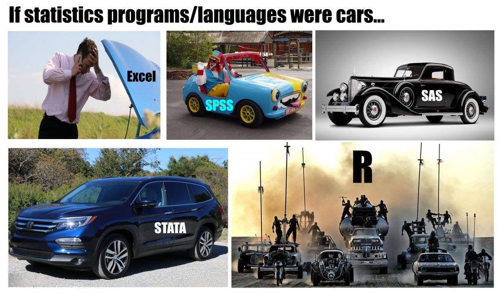

# Introducción a R

## ¿Qué es R?




### Algo de historia de R

  * R es el hermano de S
  * S es un lenguaje de programación estadística desarrollado por John Chambers de Bell Labs
  * El objetivo de S era “convertir las ideas en el software, de forma rápida y fielmente”
  * S fue creado en 1976 y se reinvento 1988 introduciendo muchos cambios
  * En 1993, StatSci (fabricante de S-Plus) adquieren licencia exclusiva a S
  * S-Plus integra S con una interfaz gráfica de usuario agradable y pleno apoyo al cliente
  * R Fue creado por Ross Ihaka y Robert Gentleman de la University of Auckland, New Zealand

### Acerca de R

  * El proyecto R inicio en 1991
  * R apareció por primera vez en 1996 como un software de código abierto!
  * Altamente personalizable a través de paquetes
  * La comunidad R, se basa en el poder de la colaboración con miles de paquetes de libre disposición
  * Existen muchas interfaces gráficas de usuario de R libres y comerciales (por ejemplo R Studio y Revolución)

### ¿Qué es R?

R es un conjunto integrado de servicios de software para la manipulación de datos, cálculo y representación gráfica. Incluye:

  * instalación sencilla y un fácil almacenamiento de datos
  * un conjunto de operadores para los cálculos en arrays, particularmente en las matrices
  * facilidad en los gráficos y el análisis de datos y
  * bien desarrollado, lenguaje de programación sencillo y eficaz que incluye condicionales, bucles, funciones recursivas definidos por el usuario.
  * Altamente intuitivo

> A pesar de ser libre y de código abierto, R es ampliamente utilizado por los analistas de datos dentro de las empresas y el mundo académico. (R en the NY Times)
Ver [NY Times](https://www.nytimes.com/2009/01/07/technology/business-computing/07program.html?pagewanted=all&_r=0) artículo.

### Algunas referencias


## RStudio

RStudio es un ambiente libre y abierto de desarrollo de código integrado.

  * multiplataforma
  * El resaltado de sintaxis, completado de código, y la sangría inteligente
  * gestionar fácilmente múltiples directorios de trabajo
  * Flexible para el manejo de gráficos
  * Integrado con Knitr
  * Integrado con Git
  
## Instalación

  * R-CRAN https://cran.r-project.org/ (elija el Sistema operativo, descargue y siguiente, siguiente…)
  * R-Studio https://www.rstudio.com/ (elija el Sistema operativo, descargue y siguiente, siguiente…)
  
Nota: Para actualizar ambos paquetes: descargue la nueva versión e instale (las librerías no sufren cambios).

## Github y el trabajo en repositorios


## R Markdown 

**"R Markdown"** se introdujo por primera vez en el paquete knitr a principios de 2012. La idea era incrustar fragmentos de código (de R u otros) en los documentos de Markdown. De hecho, knitr soportó varios lenguajes de autoría desde el principio además de Markdown, incluidos LaTeX, HTML, AsciiDoc, reStructuredText y Textile.

Markdown se ha convertido en el formato de documento más popular. La simplicidad de Markdown se destaca claramente entre estos formatos de documentos.

### Instalación

```{r,eval=F}
install.packages('rmarkdown')

# Si se prefiere la versión en desarrollo
if (!requireNamespace("devtools"))
  install.packages('devtools')
devtools::install_github('rstudio/rmarkdown')
```

Si el objetivo es usar Markdown para generar documentos PDF se necesita instalar Latex.

Existen cheatsheets utiles para usar markdown, como: [cheatsheets](https://github.com/rstudio/cheatsheets/raw/master/rmarkdown-2.0.pdf)

### YAML Header
Al inicio del archivo y entre las lineas ---

```{r,eval=FALSE}
---
title: Mi documento
author: Juan Perez
date: Marzo 22, 20220
output: html_document
---
```


### Sintaxis básica

Énfasis sobre el texto,
```{r,eval=FALSE}
*italic*   **bold**
_italic_   __bold__
```

Secciones, 

```{r,eval=FALSE}
# Header 1
## Header 2
### Header 3
```

Items (viñetas) no ordenadas y ordenadas,

```{r,eval=FALSE}
* Item 1
* Item 2
    + Item 2a
    + Item 2b

1. Item 1
2. Item 2
3. Item 3
    + Item 3a
    + Item 3b
```

Palabras clave con referencias web,

```{r,eval=FALSE}
[linked phrase](http://example.com)
```

Imágenes simples o con titulo,

```{r,eval=FALSE}


```

Blockquotes

> It's always better to give than to receive.

```{r,eval=FALSE}
A friend once said:

> It's always better to give than to receive.
```

Ecuaciones en linea y en párrafo,

En linea $\sum_i{x^2}$ o en párrafo:

$$\sum_i{x^2}$$

```{r,eval=FALSE}
$equation$

$$ equation $$
```

### Tipos de documentos

* beamer_presentation
* github_document
* html_document
* ioslides_presentation
* latex_document
* md_document
* odt_document
* pdf_document
* powerpoint_presentation
* rtf_document
* slidy_presentation
* word_document

### Chunks

Los chunks son entornos que permiten incluir código en R dentro de las distintos tipos de documentos que genera Rmarkdown, los chunks inician con ````  ```{r} y termina con ``` ````, también es posible introducir chunks en linea con el texto, esto se logra introduciendo 

```{r,eval=F}
Texto ... `r <code>` ... texto
```

La parte {r} del chunk sirve para introducir las distintas opciones que va a contener ese chunk, las opciones disponibles son:

  * echo (default = TRUE), muestra el código del chunk en la salida del documento
  * eval (default = TRUE), corre el código del chunk
  * message (default = TRUE), muestra los mensajes que genera el chunk

Existen funciones útiles para mejorar las salidas de tablas, tales como xtable y kable de la librería knitr.

## R básico

R es una calculadora demasiado grande

```{r}
123+456
4657*89
12/34
2443-3434
```

### Lógica de los comandos en R

Como entiende R los comandos

 > comando(argumentos, argumentos, ...)

Advertencia:

  * No es posible resumir un comando
  * R distingue mayúscula de minúscula
  * Siempre cerrar los paréntesis
  * R entiende el orden de los argumentos o su nombre clave

Comando para pedir ayuda

```{r,eval=F}
?mean # comando para pedir ayuda
?lm
```

Escribir varios comandos en una sola línea.

```{r}
123*56 ; 435+3544 ; 454+56
#este es un comentario
1+4;78+89
```


### Palabras reservadas y simbolos especiales de R

  * NA: datos perdidos
  * NULL: datos nulos
  * Inf -Inf: Infinito
  * #: comentario en el código
  * TRUE (T), FALSE (F): valores lógicos
  * NaN: not a number
  * ?: Ayuda
  * x, ,x + y, x - y ,x * y ,x / y ,x ^ y (**),x %% y (mod) ,x %/% y (div int)
  * ! x, .x & y ,x && y ,x | y ,x || y
  * >, <, >=, <=
  
### Símbolos Lógicos

```{r}
!(5>6) # negación
2^2 == 4 # igualdad
2^2 != 4 # desigualdad
(5>6) & (2^2==4) # y lógico
(5>6) | (2^2==4) # ó lógico

(5>6) && (2^2==4) # y lógico
(5>6) || (2^2==4) # ó lógico

5 >= 5
5 <= 5
```

### Asignación o creación de objetos (estructuras, variables)


```{r}
x<-5
y=10
15->z
x1<<-20
x2<-"Hola"
x3<-'hola'
z*y^x
x1+z
x4<-(4>5)
x5<-(y>x^2)
```

Trate de usar nombres significativos! Miren esto:

[Hadley Wickham's book](http://adv-r.had.co.nz/)
[Naming](https://guiquanz.gitbooks.io/google-cc-style-guide/content/ebook/Naming.html)

### Clases en R

```{r}
y1<-50
y2<-"hola"
y3<-(56>60)
y4<-NA  
y5<-NULL

class(y1)
class(y2)
class(y3)
class(y4)
class(y5)

typeof(y1)
typeof(y2)
typeof(y3)
typeof(y4)
typeof(y5)

z<-"12314234"
class(z)
z2<-as.numeric(z)
class(z2)
# as.character
```

### Algunas comandos adicionales

```{r}
rm(y) # eliminar objetos
rm(y1,y2,y3,y4)

# listando los objetos en memoria
ls()
# remover todos los objetos en memoria
rm(list=ls())
```


## Tipos de estructuras en R

### Homogéneas

* Scalar: un único valor

```{r}
x<-1
y<-"hola"
i<-TRUE
j<-FALSE
w<-F
```

* Vectores: Colección de valores simples. Los vectores en R son vectores columna  

```{r}
# definición
x1<-c(2,4,6)
x2<-c(1,2,3,4,7,9,4,2)
x3<-c("hola","chau","adios","hola")
x4<-c(T,T,T,F,F,F,F,T,F,T,F,F,F)
x5<-c(1,2,3,T,T,"Hola")
x6<-c(1,2,3,T,T,F,F)
# operaciones con vectores
x1+x1
x1+x2 # mal ejemplo
x1**2
x1/x1
x2>5

log(x2) # logaritmo
exp(x2) # exponencial
sqrt(x2) # raíz cuadrada

2^x2
2/x1
# generando vectores
v1<-1:10
v2<-1:10000
sum(v2) #sumar
v3<-100:1
v4<-99:0

v5<-seq(1,100,2)
v6<-seq(0,1,0.01)
seq(by=10,to=100,from=-20)# anotando el nombre de los argumentos
seq(-20,100,10) # respetando el orden de los argumentos

v7<-rep(1,100) # repetir algo 
v8<-rep(c(1,2,3),10)
v9<-rep(c("hola","cómo","estas","?"),10)
length(v8) # conocer el tamaño del vector
length(v6) # conocer el tamaño del vector
# vectores estadísticos, generación de variables aleatorias
set.seed(1234)
x<-runif(100,10,20)
mean(x)
x
z<-round(x,10)
y<-rnorm(100000,10,5)
hist(y)
```

* Matrices

```{r}
A<-matrix(c(1,2,3,4),2,2)
matrix(c(1,2,3,4),2,2,byrow=T)
B<-A>=2
B
matrix(c("Hola","como", "estan","chau"),2,2)
matrix(c("Hola",1,2,3),2,2)
matrix(1:10,2,5)
matrix(1:10,5,2)
matrix(1:10,5,5)
# funciones para crear otras matrices
diag(1,5,5)
diag(1:5,5,5)
# Matriz inversa
C<-matrix(c(2,5,3,7),2,2)
solve(C)
det(C)
# operaciones con matrices
A+C
A-C
A*C # elemento a elemento
A %*% C # Multiplicación matricial
t(C)# transpuesta
D<-C %*% t(C)     # Simétrica
C %*% solve(C) # Inversa
# Desc. Matriz
eigen(D)
svd(D)
qr(D)
dim(D)
```

* Arrays (Generalización)

```{r}
array(1:27,c(3,3,3))
array(1:81,c(3,3,3,3))
```


### Heterogéneas

Estas estructuras permiten el uso de diferentes tipos de clases u objetos.

* Dataframes (Bases de datos)

Tiene una estructura similar a una matriz, donde se define que las filas corresponden a observaciones/sujetos y las columnas son variables.

```{r}
#encuesta en la sala de clases
id<-1:8
name<-c("adriana","anahi","miguel","rayner","rebeca","sergio","vania","yoselin")
mujer<-c(1,1,0,0,1,0,1,1)
bd<-data.frame(id,name,mujer)
bd
dim(bd)
str(bd)# estructura del objeto
# incorporando variables
bd$edad<-round(runif(8,19,25),0)
bd
```

* Listas
Las listas en R son de los objetos más poderosos que tiene, ya que permite almacenar todo.

```{r}
w1<-list(bd,bd,C,1:10000,"Hola",1:10^6)
w1
str(w1)
object.size(w1)/10^6

w2<-list(w1,w1,list(w1,C),C,1:1000) # R puede encapsular objetos de tipo
str(w2)
object.size(w2)/10^6
```

## Indexación en R

Es el proceso de manejar los elementos dentro de los objetos.

```{r}
#VECTORES
x<-1:100
x[c(1,5,7)]
x[-c(1,5,7)]
o<-(x %% 2)==0
x[o]
x2<-c(2,3,7,4)
x2[c(T,T,F,F)]
#matrices
A<-matrix(1:30,5,6)
A[ 3, 4]
A[3, ]
A[c(1,4), ]

A[,1:2 ]
A[,-c(1:2) ]
A[3:4,c(1,3)]
A[c(T,T,F,T,T),c(T,F,T,T,T,F)]
#data frame
bd[1:3,2:3]
# también es posible usar el nombre de las variables 
bd[1:6,c("name","id")]
bd[,-c(3)]
bd$mujer
mean(bd$mujer)
bd[c(2,6,8),]
bd[bd$edad<=21 & bd$mujer==1,]
#bd %>% filter(mujer==1 & edad<=21)
```

## Loops y condiciones en R

```{r,eval=F}
rm(list = ls())
x<-5
## if
if(x>6){
  hist(rnorm(100,3,2))
}
## if else
if(x>6){
  hist(rnorm(100,3,2))
} else {
  boxplot(rnorm(100,3,2))
}
## if encadenado
x<-60
if(x>6){
  hist(rnorm(100,3,2))
  mean(x)
} else if(x<6){
  boxplot(rnorm(100,3,2))
} else if(typeof(x)=="double"){
  print("hola")
} else {
  print("hola hola")
}
##for
for(i in 1:100){
  print(i)
}
for(i in c(2,7,9,15,19)){
  print(i)
}  
for(i in c("a","b","c")){
  print(i)
}  
for(i in 1:5){
  for(j in 6:10){
    print(i*j)
  }
}
for(i in 1:5){
  for(j in 6:10){
    aux<-i*j
    print(aux)
    if(aux==20){
      break()
      print("hola")
      boxplot(rnorm(100,i,j))
    }
  }
}

for(i in 1:50){
  print(i)
  if(i==20){
    break()
  }
}

#while
z<-1
k<-1
while(z>0.0001){
  print(k)
  z<-1/k
  k<-k+1
}
z==0.0001
```

## Crear funciones en R.

Una función en R tiene la misma idea de lo que realiza una función en cálculo $f(x)=y$, $f(x)=x^2=y$, $f(x,y)=.()$.

Estructura básica de una función en R.
  
  * El nombre de la función ($f$)
  * Los argumentos $X,Y,\ldots$
  * Los procedimientos dentro de la función
  * Las salidas $y$
  
```{r,eval=F}
nombrefuncion<-function(x){
  print("Hola")#procedimiento 1
  y<-x^2 #procedimiento 2
  return(y)
}
nombrefuncion(x=2)
nombrefuncion(x=2:10)

x2<-nombrefuncion(x=1:100)
x2
x3<-nombrefuncion(2:5)
x3
###### funciones matemáticas
ff<-function(x){
  y<-x^2
  return(y)
}
gg<-function(x){
  y<-log(x)
  return(y)
}
hh<-function(x){
  y<-exp(-x^2)
  return(y)
}
curve(ff,xlim=c(-10,10))
curve(gg,xlim=c(0,100))
curve(hh,xlim=c(-10,10))
```

Ejemplo, desarrolle una función que dado un vector numérico de valores enteros, devuelva;

  * La suma de los números pares
  * La suma del vector
  * Coeficiente de variación del vector
  
```{r,eval=F}
tarea1<-function(x){
  s1<-sum(x[x %% 2 ==0])
  s2<-sum(x)
  s3<-sd(x)/mean(x)
  return(list(suma_pares=s1,suma=s2,cv=s3))
}
tarea1(1:10)
####################################################
tarea1_alt<-function(x){
  return(list(suma_pares=sum(x[x %% 2 ==0]),suma=sum(x),cv=sd(x)/mean(x)))
}
tarea1_alt(1:10)
tarea1(rnorm(100))

x<-1:10
sum(1:10)
cumsum(1:10)
tail(cumsum(1:10),1)

# el comando scan permite leer los datos directamente por la consola
xx<-scan()
tarea1(xx)
```

Otros ejemplos,  

```{r,eval=F}
fx<-function(x){
  y<-8*x**2
  return(y)
}
fx(5)
fx(1:10)
curve(fx,xlim = c(-20,20),ylim=c(0,1000))
plot(fx)
##comando de estadísticas de tendencia central
tendencia<-function(x){
  n<-length(x)
  cat("media:",fill = T)
  print(sum(x)/n)
  cat("mediana:",fill = T)
  x<-sort(x)
  if(n%%2==0){
    me<-(x[n/2]+x[n/2+1])/2
  } else {
    me<-x[ceiling(n/2)]
  }
  print(me)
  cat("moda:",fill = T)
  tt<-table(x)
  mm<-max(tt)
  print(names(tt)[(table(x)==mm)])
  cat("media cuadrática:",fill = T)
  mc<-sqrt(sum(x**2)/n)
  print(mc)
  cat("media armónica",fill = T)
  ma<-n/sum(1/x)
  print(ma)
  cat("media geométrica:",fill = T)
  mg<-prod(x)**(1/n)
  print(mg)
}

tendencia2<-function(x){
  n<-length(x)
  media<-sum(x)/n
  x<-sort(x)
  if(n%%2==0){
    me<-(x[n/2]+x[n/2+1])/2
  } else {
    me<-x[ceiling(n/2)]
  }
  tt<-table(x)
  mm<-max(tt)
  mo<-names(tt)[(table(x)==mm)]
  mc<-sqrt(sum(x**2)/n)
  ma<-n/sum(1/x)
  mg<-prod(x)**(1/n)
  aux<-list(media,me,mo,mc,ma,mg)
  return(aux)
}
a<-tendencia2(xx)

tendenciaF<-function(x,f){
  n<-sum(f)
  media<-sum(x*f)/n
}
```

## Flexdashboard

Es una librería de R que permite crear tableros de datos (dashboard), la salida final esta diseñada para un entorno web (html). 

```{r,eval=F}
install.packages("flexdashboard")
library(flexdashboard)
```

## Shiny 

Shiny es una librería de RStudio orientada a crear aplicaciones web interactivas con R. Una vez instalada existen dos formas de crear una aplicación en Shiny.
Una alternativa cada vez mas popular es la de crear un documento shiny junto con Markdown.

1. Mediante un solo archivo denominando app.R
2. Mediante dos archivos separados, el server.R y ui.R

Se recomienda que en cualquiera de las dos alternativas, estos archivos estén contenidos en alguna carpeta. Existen dos partes esenciales al momento de definir una app en Shiny, el UI que es una función que define la interfaz de la aplicación y el Server que define una función con instrucciones sobre cómo construir y reconstruir los objetos R que se mostraran en la UI. La composición básica según las formas de aplicarlas son:

```{r,eval=FALSE}
# app.R
library(shiny)
ui <- fluidPage(
numericInput(inputId = "n",
"Sample size", value = 25),
plotOutput(outputId = "hist")
)
server <- function(input, output) {
output$hist <- renderPlot({
hist(rnorm(input$n))
})
}
shinyApp(ui = ui, server = server)
```

```{r,eval=F}
# ui.R

fluidPage(
numericInput(inputId = "n",
"Sample size", value = 25),
plotOutput(outputId = "hist")
)

# server.R

function(input, output) {
output$hist <- renderPlot({
hist(rnorm(input$n))
})

```

### UI

Al ser UI la interfaz esta permite la interacción directa con el usuario, a estas se las denominan los entradas $input$, las opciones de *input* son:

* **Botón de acción:** actionButton(inputId, label, icon)
* **Enlace:** actionLink(inputId, label, icon,)
* **Check box múltiple:** checkboxGroupInput(inputId,label, choices, selected, inline)
* **Check box simple:** checkboxInput(inputId, label,value)
* **Fecha:** dateInput(inputId, label, value,min, max, format, startview,weekstart, language)
* **Rango de fecha:** dateRangeInput(inputId, label,start, end, min, max, format,startview, weekstart, language,separator)
* **Cargar archivo:** fileInput(inputId, label, multiple,accept)
* **Entrada numérica:** numericInput(inputId, label, value,min, max, step)
* **Tipo contraseña:** passwordInput(inputId, label,value)
* **Selección tipo botones:** radioButtons(inputId, label,choices, selected, inline)
* **Seleccionable:** selectInput(inputId, label, choices,selected, multiple, selectize,width, size) 
* **Slider:** sliderInput(inputId, label, min,max, value, step, round, format,locale, ticks, animate, * width,sep,pre, post)
* **Enviar** submitButton(text, icon)
* **Entrada de texto** textInput(inputId, label, value)

Los inputs principalmente tienen dos argumentos el **inputId** que se refiere al identificador del input, este se utiliza en el server, y el **label** que es la etiqueta que aparece en la interfaz visual, estos inputs se asignan a algún objeto (xx<-input()). En el server se tiene acceso al input mediante input$xx.

### Server

En cuanto el server, este usa los distintos inputs para generar las salidas (outputs), las opciones de salidas disponibles son:

* DT::renderDataTable(expr, options,callback, escape, env, quoted)
* renderImage(expr, env, quoted,deleteFile)
* renderPlot(expr, width, height, res, …,env, quoted, func)
* renderPrint(expr, env, quoted, func,width)
* renderTable(expr,…, env, quoted, func)
* renderText(expr, env, quoted, func)
* renderUI(expr, env, quoted, func)

Estos outputs "render" se asignan a un objeto y luego ellos deben ser incluidos dentro del UI con su correspondiente Output:

* dataTableOutput(outputId, icon, …)
* imageOutput(outputId, width, height,click, dblclick, hover, hoverDelay, inline,hoverDelayType, brush, clickId,hoverId)
* plotOutput(outputId, width, height, click,dblclick, hover, hoverDelay, inline,hoverDelayType, brush, clickId,hoverId)
* verbatimTextOutput(outputId)
* tableOutput(outputId)
* textOutput(outputId, container, inline)
* uiOutput(outputId, inline, container, …) y htmlOutput(outputId, inline, container, …)
