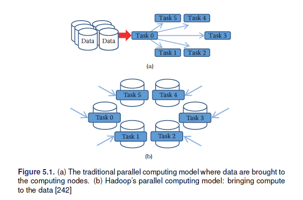
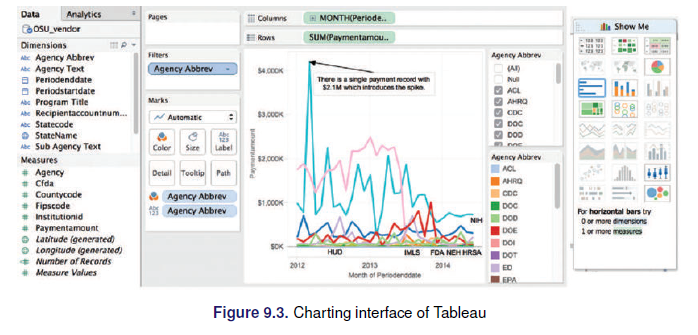

# Introducción al Big Data

## Conceptos y terminología
  
  - Datasets: Colección de datos, comparte el mismo conjunto de atributos o propiedades 
  - Análisis de datos: El análisis de datos es el proceso de examinar datos para encontrar hechos, relaciones, patrones, ideas y/o tendencias. El objetivo general del análisis de datos es apoyar una mejor toma de decisiones.

### Actividad 1

Para las siguientes áreas explore e identifique posibles datasets y algunos objetivos para el análisis de datos:

  + Banca
  + Salud
  + Educación
  + Telecomunicaciones
  + Agricultura
  + Comercio exterior
  
Explore si existen datos abiertos en Bolivia respecto su respuesta.

## Analítica de datos

La analítica de datos es un término más amplio, incluye la gestión del ciclo de vida completo de los datos, que abarca la recopilación, limpieza, organización, almacenamiento, análisis. El término incluye el desarrollo de métodos de análisis, técnicas científicas y
herramientas. 

+ En entornos orientados a los negocios, los resultados de la analítica de datos pueden reducir los costos operativos y facilitar la toma de decisiones estratégicas.
+ En las ciencias, la analítica de datos puede ayudar a identificar la causa de un fenómeno para mejorar la precisión de las predicciones.
• En entornos basados en servicios como las organizaciones del sector público, puede ayudar a fortalecer el enfoque en la prestación de servicios de alta calidad mediante la reducción de costos.

  + Valor: Compresión en retrospectiva, conocimiento/percepción, previsión 
  + Complejidad: Baja, media, alta

### Análisis descriptivo

El análisis descriptivo se lleva a cabo para **responder preguntas sobre eventos que ya han ocurrió**. Esta forma de análisis **contextualiza** los datos para generar información. 

  - Estadística descriptiva
  - Inferencia descriptiva

### Análisis de diagnóstico

El análisis diagnóstico tiene como objetivo determinar la **causa** de un fenómeno que **ocurrió en el pasado**. usando preguntas que se enfocan en la razón detrás del evento. El objetivo de este tipo de análisis es determinar **qué información está relacionada con el fenómeno** para permitir responder preguntas que buscan determinar por qué ha ocurrido algo.

### Análisis predictivo

El análisis predictivo se lleva a cabo en un intento de determinar el **resultado de un evento que podría ocurrir en el futuro**. Con el análisis predictivo, la información se mejora con significado generar conocimiento que transmita cómo se relaciona esa información. La fuerza y magnitud de las asociaciones forman la base de los modelos que se utilizan para generar futuros predicciones basadas en eventos pasados. Es importante entender que los **modelos utilizados para el análisis predictivo tiene dependencias implícitas** en la condiciones bajo las cuales el pasado ocurrieron los hechos. Si estas condiciones subyacentes cambian, entonces los modelos que hacen predicciones necesitan ser actualizadas.

  + Inferencia predictiva
  + Inferencia causal

### Análisis prescriptivo

El análisis prescriptivo se **basa en los resultados del análisis predictivo** al prescribir acciones que se deben tomar. El enfoque no es solo en qué opción prescrita es mejor seguir. En otras palabras, el análisis prescriptivo proporciona resultados sobre los que se puede razonar, porque incorporan elementos de comprensión situacional. Por lo tanto, este tipo de análisis puede utilizarse para obtener una ventaja o mitigar un riesgo.

### Ejercicio

Determinar el tipo de análisis que se requiere en las siguientes solicitudes:

  - El INRA quiere conocer el efecto que tiene la titulación de tierras sobre los ingresos de los productores agropecuarios. **Diagnóstico, Predictivo**
  - UNICEF quiere conocer el nivel de pobreza que existe en los hogares con NNA y los factores que explican estos resultados. **Descriptivo, diagnóstico**
  - UNFPA quiere saber el efecto que tuvo sus campañas de violencia que realizó en las universidades públicas del país **Diagnóstico, Predictivo**
  - KAS quiere conocer los valores democráticos de los jóvenes **descriptivo**
  - OIM quiere saber que tipos de mensajes de empleo están vinculados a trata y tráfico para monitorear **predictivo**

## Inteligencia de Negocios (BI)

BI permite a una organización obtener información sobre el rendimiento de una empresa mediante el análisis de los datos generados por sus procesos comerciales y sistemas de información. La gerencia puede utilizar los resultados del análisis para **dirigir el negocio** en un esfuerzo por **corregir los problemas** detectados o mejorar el desempeño de la organización. BI aplica análisis a grandes cantidades de datos en toda la empresa, que normalmente se ha consolidado en un **almacén de datos empresarial** para ejecutar consultas analíticas.

## Indicadores clave de rendimiento (KPI: Key Performance Indicators)

Un KPI es una métrica que se puede usar para medir el éxito dentro de un contexto comercial particular.
Los KPI están vinculados con **las metas** y objetivos estratégicos generales de una empresa. A menudo se utilizan para identificar problemas de **rendimiento empresarial** y demostrar el cumplimiento normativo. Por lo tanto, los KPI actúan como puntos de referencia **cuantificables** para medir un aspecto específico del rendimiento general de una empresa.

  - Marcos lógicos de un proyecto

## Caracterísitcas del Big Data

Las V. 

  + **Volumen:** Tamaño del dataset 
  + **Velocidad:** Resultados oportunos 
  + **Variedad:** Estructuradas, no estructuradas
  + **Veracidad:** calidad y legitimidad de la información
  + **Valor:** Los resultados deben ser útiles
  
https://www.domo.com/data-never-sleeps#  
  
  

## Tipos de datos

  - *Estructurados (tabla):* Tiene la forma de una tabla, donde las filas hacen referencia a observaciones y las columnas a atributos/variables.
  - *No estructurados (no tabla):* Normalmente se refiere a archivos de audio, imágenes, documentos, etc.
  - *Semi estructurados (XML, JSON, Sensor):* Son objetos que presentan una estructura que puede ser transformada a algo estructurado.

## Almacenes de datos

  + *ETL:* Extraer, transformar, guardar. El resultado es una base de datos transformada.  
  + *ELT:* Extraer, guardar, transformar: Se cuenta con una base de datos bruta/original, normalmente este enfoque consume más espacio.

## Calidad de dato y Big Data

La mayoría de los datos en el mundo real son ruidosos, inconsistentes y adolecen de valores perdidos, independientemente de su origen. Incluso si la recopilación de datos es barata, los costos de crear datos de alta calidad a partir de la fuente (limpieza, conservación, estandarización e integración) son considerables. La calidad de los datos se puede caracterizar de múltiples maneras:

* **Precisión:** ¿qué tan precisos son los valores de los atributos en los datos?
* **Integridad:** ¿están completos los datos?
* **Consistencia:** ¿Cuán consistentes son los valores en y entre las bases de datos?
* **Puntualidad:** ¿qué tan oportunos son los datos?
* **Accesibilidad:** ¿están disponibles todas las variables para el análisis?

Los cientistas de datos tienen décadas de experiencia en la transformación de datos desordenados, ruidosos y no estructurados en un conjunto de datos bien definido, claramente estructurado y probado en calidad. El pre procesamiento es un proceso complejo y que lleva mucho tiempo porque es *práctico*: requiere juicio y no puede automatizarse de manera efectiva. Un flujo de trabajo típico comprende múltiples pasos desde la definición de datos hasta el análisis y termina con el filtrado. Es difícil exagerar el valor del pre-procesamiento para cualquier análisis de datos, pero esto es particularmente cierto en big data. Los datos deben analizarse, estandarizarse, no duplicarse y normalizarse.

* **Análisis (parsing):** Exploración de datos
* **Estandarización (Standardization):** Identificar variables que requieren transformación y ajustes.
* **Duplicación:** Consiste en eliminar registros redundantes
* **Normalización (Normalization):** Es el proceso de garantizar que los campos que se comparan entre archivos sean lo más similares posible en el sentido de que podrían haber sido generados por el mismo proceso. Como mínimo, se deben aplicar las mismas reglas de estandarización a ambos archivos.

## Captura y preservación
Se refiere al proceso de obtener la información de las distintas fuentes posibles y luego pasar a un proceso de preservación. 

### Fuentes convencionales
Estas están basadas en la información que se distribuye de forma tradicional mediante bases de datos estructuradas, normalmente estas las distribuyen instituciones con amplios conocimientos en la gestión de bases de datos, para el caso de Bolivia se puede citar algunas: 

* Instituto Nacional de Estadística
* SNIS
* UDAPE
* Geoboliva
* Ministerios ...

### Datos web y APIs

Se refiere a la captura y uso de la información que se genera en espacios digitales, web, redes sociales, etc.

Referirse al capítulo 3 de scraping web, estos son los mecanismos para extraer información en internet

### Record Linkage

Se refiere al proceso de concatenar o unir observaciones dispuestas en múltiples bases de datos.

  * Puede ser usado para compensar la falta de información
  * Se usa para crear estudios longitudinales
  * Se pueden armar seudo-paneles

Esto permite mejorar la cobertura (append), ampliar las temáticas de estudio (merge). 

  * Matching: Une información a partir de una clave, existen muchos problemas con claves tipo texto.
  * Aproximaciones a reglas para hacer math: Definir criterios para posibilitar el match basados en reglas, distancias cercanas, etc.
  * Match basados en probabilidad: Fellegi–Sunter method

### Bases de datos

Una vez que los datos fueron recolectados y enlazados entre diferentes fuentes, es necesario guardar la información. Ahora se discute las alternativas para guardar la información. 

  * DBMS (databasemanagement systems) Sistema de gestión de base de datos: Decidir que herramienta usar segun la dimensión de los archivos.
  

  
  * Bases de datos espaciales
  * Múltiples formatos: https://juliael.carto.com/

### Programando con Big Data

  * MapReduce: map, shuffle y reduce

  * Apache hadoop MapReduce (Hadoop Distributed File System HDFS)
  * Apache Spark
  

## Análisis y modelado

### Machine learning

**¿Machine learning = Statistics?**

Verán que muchos métodos discutidos a lo largo de su formación como estadísticos aparecen dentro del maching learning y que son llamados con otros nombres. 

Al pensar en machine learning debemos asociarlo directamente con procesos computacionales, muchos otros conceptos giran al rededor de esta idea como la inteligencia artificial. Proceso de machine learning hoy:

  * Permiten manejar autos de forma autónoma
  * Puede recomendar libros, amistades, música, etc
  * Identificar drogas, proteínas y ciertos génes
  * Se usa para detectar ciertos tipos de cáncer y otras enfermedades médicas
  * Ayudan a conocer que estudiantes necesitan un apoyo adicional 
  * Ayudan a persuadir por que candidato votar en las elecciones.

#### El proceso del machine learning
  
  * Entender el problema y la meta
  * Formular esto como un problema de machine learning
  * Explorar y preparar los datos
  * Feature engineeing 
  * Selección del método
  * Evaluación
  * Deployment

#### Formulación del problema
En ML existen 2 grandes categorías

  1. Aprendizaje supervisado: Existe una $Y$ que queremos predecir o clasificar a partir de los datos. El fin es el ajuste y la generalización
    * Clasificación ($Y$ cualitativa)
    * Predicción 
    * Regresión ($Y$ cuantitativa)
    
  2. Aprendizaje no supervisado: No existe una variable objetivo, se quiere conocer, entender las asociaciones y patrones naturales en los datos. 
    * Clustering
    * PCA, MCA
    

### Análisis de texto: Entendiendo lo que la gente escribe

  * Clasificación de documentos
  * Análisis de sentimientos
  * Etiquetado de discursos
  
### Networks

## Inferencia y ética

### Información y visualización

> Los usuarios pueden escanear, reconocer, comprender y recordar representaciones visualmente estructuradas más rápidamente de lo que pueden procesar representaciones no estructuradas

> La ciencia de la visualización se basa en múltiples campos, como la psicología perceptiva, las estadísticas y el diseño gráfico para presentar información

> La efectividad de una visualización depende tanto de las necesidades de análisis como de los objetivos de diseño.

> El diseño, el desarrollo y la evaluación de una visualización se guían por la comprensión de los antecedentes y las metas del público objetivo.

El desarrollo de una visualización efectiva es un proceso iterativo que generalmente incluye los siguientes pasos:

  * Especificar las necesidades del usuario, tareas, requisitos de accesibilidad y criterios para el éxito.
  * Preparar datos (limpiar, transformar).
  * Diseñar representaciones visuales.
  * Interacción de diseño.
  * Planifique el intercambio de ideas, procedencia.
  * Prototipo / evaluación, incluidas las pruebas de usabilidad.
  * Implementar (supervisar el uso, proporcionar soporte al usuario, gestionar el proceso de revisión).

#### Dashboards

#### Elementos

#### Datos espaciales

* Datos temporales
* Datos jerárquicos
* Datos de redes
* Datos de texto

## Ejercicios

1. Explorar los métodos cuasi-experimentales que existen 
2. Buscar información respecto a: los matriculados en educación regular y universidad por año y departamento en Bolivia
3. Empleando la fuente anterior, generar en R el código que cargue el archivo encontrado 
4. Buscar dos papers (1) donde se uso machine learning y (2) análisis de texto y comentar con al menos 5000 caracteres
5. Buscar ejemplos (al menos uno) de bases de datos, páginas web u otros asociados a datos que no respeten los principios de privacidad y confidencialidad.

