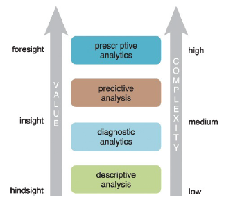

# Introducción al Big Data

## Conceptos y terminología
  
  - Datasets: Colección de datos, comparte el mismo conjunto de atributos o propiedades 
  - Análisis de datos: El análisis de datos es el proceso de examinar datos para encontrar hechos, relaciones, patrones, ideas y/o tendencias. El objetivo general del análisis de datos es apoyar una mejor toma de decisiones.

### Actividad 1

Para las siguientes áreas explore e identifique posibles datasets y algunos objetivos para el análisis de datos:

  + Banca
  + Salud
  + Educación
  + Telecomunicaciones
  + Agricultura
  + Comercio exterior
  
Explore si existen datos abiertos en Bolivia respecto su respuesta.

## Analítica de datos

La analítica de datos es un término más amplio, incluye la gestión del ciclo de vida completo de los datos, que abarca la recopilación, limpieza, organización, almacenamiento, análisis. El término incluye el desarrollo de métodos de análisis, técnicas científicas y
herramientas. 

+ En entornos orientados a los negocios, los resultados de la analítica de datos pueden reducir los costos operativos y facilitar la toma de decisiones estratégicas.
+ En las ciencias, la analítica de datos puede ayudar a identificar la causa de un fenómeno para mejorar la precisión de las predicciones.
• En entornos basados en servicios como las organizaciones del sector público, puede ayudar a fortalecer el enfoque en la prestación de servicios de alta calidad mediante la reducción de costos.

  + Valor: Compresión en retrospectiva, conocimiento/percepción, previsión 
  + Complejidad: Baja, media, alta

### Análisis descriptivo

El análisis descriptivo se lleva a cabo para responder preguntas sobre eventos que ya han ocurrió. Esta forma de análisis contextualiza los datos para generar información. 

  - Estadística descriptiva
  - Inferencia descriptiva

### Análisis de diagnóstico

El análisis diagnóstico tiene como objetivo determinar la causa de un fenómeno que ocurrió en el pasado. usando preguntas que se enfocan en la razón detrás del evento. El objetivo de este tipo de análisis es determinar qué información está relacionada con el fenómeno para permitir responder preguntas que buscan determinar por qué ha ocurrido algo.

### Análisis predictivo

El análisis predictivo se lleva a cabo en un intento de determinar el resultado de un evento que podría ocurrir en el futuro. Con el análisis predictivo, la información se mejora con significado generar conocimiento que transmita cómo se relaciona esa información. La fuerza y magnitud de las asociaciones forman la base de los modelos que se utilizan para generar futuros predicciones basadas en eventos pasados. Es importante entender que los modelos utilizados para el análisis predictivo tiene dependencias implícitas en la condiciones bajo las cuales el pasado ocurrieron los hechos. Si estas condiciones subyacentes cambian, entonces los modelos que hacen predicciones necesitan ser actualizadas.

### Análisis prescriptivo

El análisis prescriptivo se basa en los resultados del análisis predictivo al prescribir acciones
que se debe tomar. El enfoque no es solo en qué opción prescrita es mejor seguir. En otras palabras, el análisis prescriptivo proporciona resultados sobre los que se puede razonar. porque incorporan elementos de comprensión situacional. Por lo tanto, este tipo de análisis puede utilizarse para obtener una ventaja o mitigar un riesgo.

### Actividad 2

Con base en los sectores de la actividad 1, realice preguntas orientadas a las cuatro tipo de analíticas.

## Inteligencia de Negocios (BI)

BI permite a una organización obtener información sobre el rendimiento de una empresa mediante el análisis de los datos generados por sus procesos comerciales y sistemas de información. La gerencia puede utilizar los resultados del análisis para dirigir el negocio en un esfuerzo por corregir los problemas detectados o mejorar el desempeño de la organización. BI aplica análisis a grandes cantidades de datos en toda la empresa, que normalmente se ha consolidado en un almacén de datos empresarial para ejecutar consultas analíticas.

## Indicadores clave de rendimiento (KPI: Key Performance Indicators)

Un KPI es una métrica que se puede usar para medir el éxito dentro de un contexto comercial particular.
Los KPI están vinculados con las metas y objetivos estratégicos generales de una empresa. A menudo se utilizan para identificar problemas de rendimiento empresarial y demostrar el cumplimiento normativo. Por lo tanto, los KPI actúan como puntos de referencia cuantificables para medir un aspecto específico del rendimiento general de una empresa.

## Caracterísitcas del Big Data

Las V. 

  + Volumen 
  + Velocidad: https://www.domo.com/data-never-sleeps#
  + Variedad 
  + Veracidad 
  + Valor

## Tipos de datos

## Almacenes de datos

  + ETL
  + ELT
  
## Inferencia descriptiva en R

### Actividad 3

## Práctica

